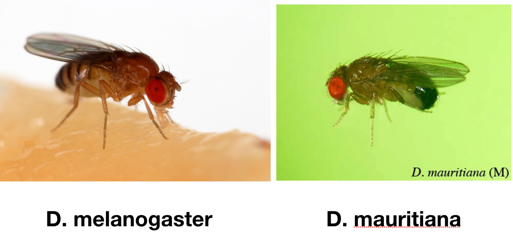

# QBB2020 - Day 2 - Lunch Exercise

Frequently when dealing with annotation data we will need to translate
identifiers according to a mapping. For example, mapping gene identifiers
to protein identifiers for searching a protein database, or identifying
orthologs using an existing orthology database (e.g. Homologene).

Here you will implement a python program to perform such a mapping. First you
will generate a mapping file in a simplified format, and then perform the
mapping.

## 1. Mapping FlyBase genes to UniProt

We want to build a mapping from FlyBase gene IDs to UniProt IDs.

Uniprot provides a mapping from FlyBase genes. You can download this mapping
using the command:

```
$ wget "http://www.uniprot.org/docs/fly.txt"
```

Opening `fly.txt` this looks difficult to parse. It has a free form header
and footer, and has rows with different numbers of fields and no clear
delimiter. One could certainly parse this file by determining field widths,
and tracking when the header ends, etc.

However, if you look at the data the fields we need are only on the lines
containing the string "DROME". This should make it much easier for you to
parse.

Parse this file, and output a new file with two tab separated columns, the
first containg the FlyBase ID and the second the Uniprot ID (AC).

> Hint: running `split` without specifying a delimiter splits on "whitespace"
> by default. For example:
> ```
> s = "first second\tthird\t\t\tfourth"           |
> print "Split on space:",      s.split(" ")      | Split on space: ['first', 'second\tthird\t\t\tfourth']
> print "Split on tab:",        s.split("\t")     | Split on tab: ['first second', 'third', '', '', 'fourth']
> print "Split on whitespace:", s.split()         | Split on whitespace: ['first', 'second', 'third', 'fourth']
> ```

## 2. Identifier mapping

Write a python script for identifier mapping.<br /><br />
Your script should take as input two files.
  1. the mapping file , `fly.text` (as retrieved and explained above)
  2. a c_tab file from StringTie
      * You have a file `SRP004442.stringtie.tar.gz`. This is found in your `~/data/results/` directory.
      * You need to run `tar -xzf SRP004442.stringtie.tar.gz` to unpack this file
          * If this command throws an error, you should alternatively use `wget`, specifically: `wget https://bx.bio.jhu.edu/track-hubs/cmdb/t_data.ctab`
      * Then your c_tab file specifically is `~/data/results/stringtie/SRR072893/t_data.ctab`


Your script should find the corresponding translation from the mapping file. If found, it should print the
line from the c_tab file, replacing the `gene_id` field with the translated
identifier. If not found, it should do one of two things depending on a command
line argument:

  1. Print nothing (ignore the line)
  2. Print and fill the field with a default value specified on the
     command line.

## Submit

Submit your two Python scripts, with any instructions needed to run them in
a documentation comment, and the first 100 lines of your output using each
of the two options.

## FAQ

1. DROME? DROMA?


